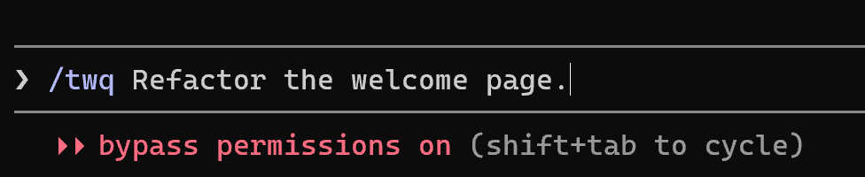

# twq — Task With Questions

A tiny [Claude Code](https://claude.com/claude-code) skill that makes Claude interview you before doing a task: it studies your request, asks clarifying questions (waiting for your answers, over as many rounds as useful), and only then proceeds.

LLMs fill ambiguity with assumptions. `/twq` forces the questions up front, so the decisions are yours instead of the model's guesses.



*Prefix any task with `/twq` — Claude studies it, asks its questions, then does the work.*

## Install

The skill is a single `SKILL.md` file. Put it in a folder named `twq` inside your Claude Code skills directory.

**macOS / Linux:**

```sh
git clone https://github.com/fabkury/twq
mkdir -p ~/.claude/skills/twq
cp twq/SKILL.md ~/.claude/skills/twq/
```

**Windows (PowerShell):**

```powershell
git clone https://github.com/fabkury/twq
New-Item -ItemType Directory -Force "$env:USERPROFILE\.claude\skills\twq" | Out-Null
Copy-Item twq\SKILL.md "$env:USERPROFILE\.claude\skills\twq\"
```

### Alternative: link instead of copy

If you'd rather have the skill update with a plain `git pull`, keep the clone wherever you like and link your skills folder to it instead of copying:

**macOS / Linux (symlink):**

```sh
git clone https://github.com/fabkury/twq
mkdir -p ~/.claude/skills
ln -s "$(pwd)/twq" ~/.claude/skills/twq
```

**Windows (PowerShell, NTFS junction — no admin rights needed):**

```powershell
git clone https://github.com/fabkury/twq
New-Item -ItemType Directory -Force "$env:USERPROFILE\.claude\skills" | Out-Null
New-Item -ItemType Junction -Path "$env:USERPROFILE\.claude\skills\twq" -Target "$PWD\twq"
```

Claude Code only reads `SKILL.md`, so the repo's other files (`README.md`, `LICENSE`, `.git`) showing up through the link are harmless. Updating is just `git pull` inside the clone — and if you tweak the skill, your edits are live immediately.

### Scope

Either method installs the skill *personally* — available in all your projects. To share it with collaborators on one specific project instead, place it at `<project>/.claude/skills/twq/SKILL.md` and commit it.

## Use

```
/twq Refactor the auth module to support SSO
```

Claude will study the task, ask you one or more rounds of clarifying questions via its question UI, wait for your answers, and then carry out the task.

## How it works

`SKILL.md` is the entire skill — a prompt template with a few lines of frontmatter:

- `$ARGUMENTS` — your task description is substituted into the prompt.
- `disable-model-invocation: true` — only you can trigger it by typing `/twq`; Claude never invokes it on its own.
- `allowed-tools: AskUserQuestion` — pre-approves the question tool the skill is built around.

## License

Public domain, under [the Unlicense](https://unlicense.org). Do whatever you want with it.
